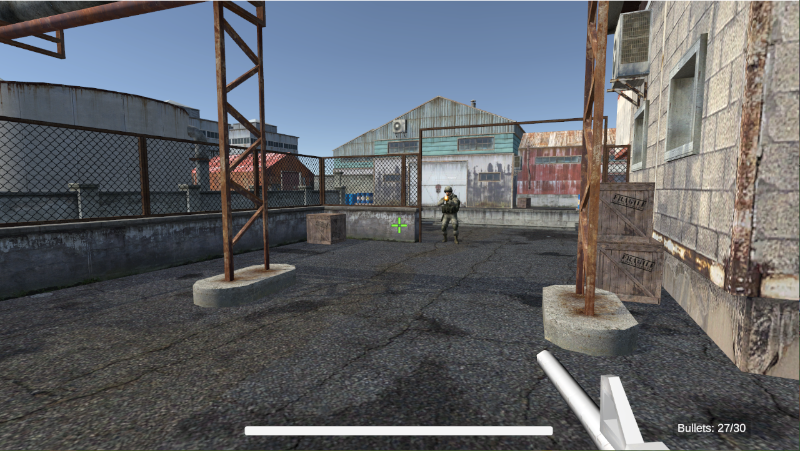
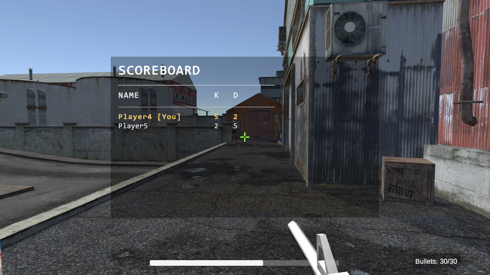
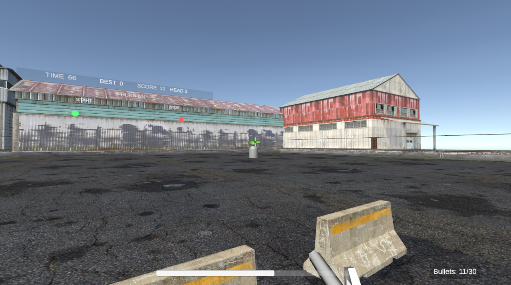

# FPS联机射击Demo（Unity / C# / Netcode）

一个基于 **Unity、C#、Netcode for GameObjects、Unity Transport** 开发的多人 FPS 联机射击 Demo。

项目围绕联机 FPS 的基础玩法与核心同步链路展开，当前实现了角色移动、武器系统、命中与伤害结算、死亡重生、计分板、训练靶场与成绩统计等功能，并重点完成了 **服务器权威射击链路** 与 **武器 ScriptableObject 数据化配置** 两项核心改造。

---

## 项目预览

### 联机对战演示

### 计分板演示

### 训练靶场演示

---

## 项目简介

本项目是一个多人第一人称联机射击 Demo，目标是搭建一套可运行、可扩展、可演示的联机 FPS 基础框架。

当前项目主要包含以下内容：

- 第一人称角色移动与视角控制
- 武器射击、换弹、切枪、命中特效与音效反馈
- 多人玩家生成、状态同步与联机对战交互
- 受伤、死亡、重生与击杀统计
- 服务器权威射击判定
- 基于 ScriptableObject 的武器数据化配置
- 爆头伤害系统
- Tab 计分板
- 训练靶场与成绩统计系统

---

## 技术栈

- **引擎：** Unity
- **语言：** C#
- **联机框架：** Netcode for GameObjects
- **网络传输：** Unity Transport
- **UI：** UGUI、TextMeshPro
- **数据配置：** ScriptableObject
- **版本管理：** Git / GitHub

---

## 核心功能

### 1. 联机角色与基础对战

- 支持 Host / Client 启动联机
- 支持玩家生成、基础状态同步与联机对战交互
- 支持第一人称移动、视角控制、跳跃、射击、换弹、切枪
- 支持玩家受伤、死亡、重生与击杀 / 死亡统计

### 2. 服务器权威射击链路

项目将射击逻辑设计为“客户端上传射击意图，服务端负责命中与伤害结算”的模式。

客户端负责：

- 检测开火输入
- 播放本地射击表现
- 上传 `weaponSlot / origin / direction`

服务端负责：

- 校验 shooter 是否有效
- 校验 direction 是否接近单位向量
- 校验 origin 与角色位置距离，降低伪造请求风险
- 根据武器槽位读取武器配置，而不是信任客户端上传伤害
- 执行 Raycast 命中检测
- 结算玩家伤害、爆头伤害、训练靶命中与靶场按钮触发

该设计可以避免客户端直接决定命中结果或任意上传伤害值，使射击判定更加合理。

### 3. 武器 ScriptableObject 数据化

项目将武器静态参数拆分到 `WeaponConfig` 中管理，将弹药数、换弹状态等运行时数据放到 `WeaponState` 中管理，并通过 `WeaponManager` 统一处理装备、切枪、换弹和当前武器查询。

当前数据化配置包含：

- 武器名称
- 伤害
- 射程
- 射速
- 开火冷却
- 后坐力
- 弹夹容量
- 换弹时间
- 爆头倍率
- 武器表现资源引用

这种拆分方式让配置与逻辑解耦，后续扩展新武器、统一调参与维护都更方便。

### 4. 爆头伤害与命中特效

项目支持头部与身体命中区分：

- 命中玩家头部时，根据 `headshotMultiplier` 计算爆头伤害
- 命中普通场景与可攻击目标时，根据材质类型广播不同命中特效
- 命中特效由各客户端本地生成，兼顾网络同步与表现反馈

### 5. 死亡、重生与计分板

- 玩家生命值与死亡状态由 `NetworkVariable` 管理
- 击杀 / 死亡统计由服务端更新
- 玩家死亡后禁用控制与碰撞，播放死亡表现
- 重生时由服务端恢复生命状态，并通过 RPC 恢复所有客户端表现
- 由于项目采用客户端权威移动，实际传送由 owner 客户端执行，从而避免被 owner 位置同步覆盖
- 支持多个 `RespawnPoint` 随机重生

计分板支持：

- 按住 `Tab` 显示，松开隐藏
- 显示玩家 `Name / K / D`
- 按击杀数降序、死亡数升序排序
- 高亮本地玩家
- 过滤训练 Bot，仅统计真人玩家

### 6. 训练靶场与成绩统计

项目额外实现了训练靶场玩法，用于验证命中链路、爆头统计与训练 UI。

训练靶场支持：

- 训练开始 / 停止控制
- 靶子按随机点位升起、隐藏
- 命中计数、爆头计数、分数统计
- 倒计时与最佳成绩记录
- 训练过程中实时刷新 UI 状态

---

## 项目迭代记录

本项目并非一次性完成，而是在基础 FPS 联机版本之上逐步扩展与重构。

### V1：基础版本搭建

完成多人 FPS 的基础玩法闭环，主要包括：

1. 项目创建与角色移动  
2. 联机  
3. 飞行和射击  
4. 射击伤害与重生  
5. 切换武器  
6. 射击特效  
7. 地图、射击音效与后坐力  
8. 角色模型  
9. 联机对战  
10. 装弹、血条与玩家 UI  

这一阶段的目标是先跑通基础联机 FPS 的核心流程。

### V2：联机功能补全与问题修复

在基础版本之上继续整理联机角色、射击表现、玩家状态同步等逻辑，并修复开发过程中暴露的交互与表现问题，使项目达到可稳定演示状态。

### V3：服务器权威射击链路

将原有射击逻辑改造成服务器权威模式。客户端只上传射击意图，服务端负责命中检测与伤害结算，降低客户端伪造命中或伤害结果的风险。

### V4：武器 ScriptableObject 数据化

将武器参数从脚本中拆出，改造成 `WeaponConfig + WeaponState` 结构，实现配置数据与运行时状态分离，提升扩展性与调参效率。

### V5：爆头伤害与计分板

补充头部命中判定，支持爆头伤害逻辑；新增击杀 / 死亡统计与 Tab 计分板，提升对战展示完整度。

### V6：训练靶场与成绩统计

增加训练靶场玩法，支持训练启停、靶子显隐升降、计时、得分、爆头统计与最佳记录展示，进一步增强项目完整度与演示效果。

---

## 关键脚本职责

- **Player.cs**：管理生命值、死亡状态、重生流程、击杀/死亡统计、随机重生点逻辑
- **PlayerShooting.cs**：管理射击输入、弹药消耗、射击请求上报、服务器权威命中检测、伤害结算与命中特效同步
- **WeaponManager.cs**：管理主副武器、切枪、换弹、武器实例化以及当前武器配置/状态查询
- **WeaponConfig.cs**：武器静态配置
- **WeaponState.cs**：武器运行时状态
- **PlayerController.cs**：角色移动、跳跃、旋转、后坐力反馈
- **PlayerUI.cs**：本地 HUD 显示
- **PlayerInfo.cs**：角色头顶信息显示
- **ScoreboardUI.cs**：计分板显示、排序与本地玩家高亮
- **RangeSessionManager.cs**：训练靶场 session 生命周期、计时、分数、爆头数与 UI 刷新
- **TrainingTarget.cs**：训练靶显隐、升降、受击与击杀判断
- **RangeControlButton.cs**：训练靶场开始 / 停止按钮触发
